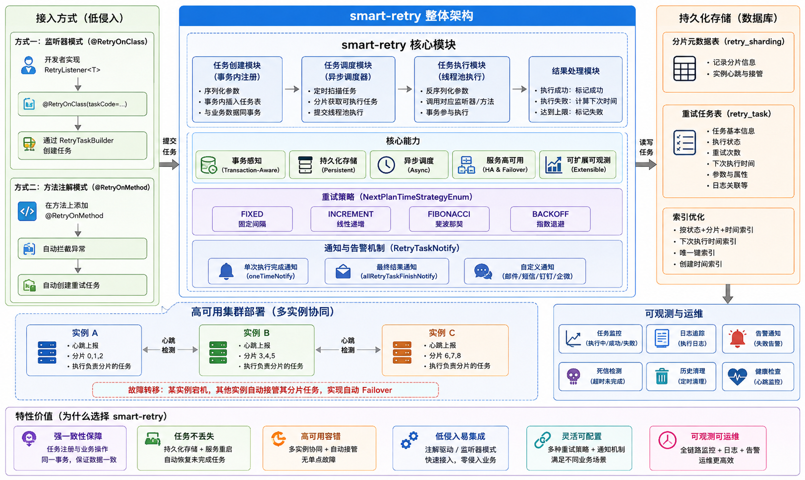

# 整体架构

### 目前本组件已经在生产环境使用，欢迎大家使用。如果有问题、欢迎提 issue。
### ✅ 1. **重试任务与业务事务强一致（Transaction-Aware Retry）**

这是 smart-retry 最重要的设计目标。。

- **问题背景**：传统重试（如 Spring Retry）在方法失败后立即重试，但如果系统崩溃或重启，未完成的重试会丢失；若用定时补偿，则“创建补偿任务”和“业务操作”不在同一事务中，可能造成数据不一致（比如订单创建成功了，但补偿任务没注册）。

- **smart-retry 的解法**：
    - 将“注册重试任务”作为一个数据库记录插入操作。
    - **该插入操作与当前业务逻辑（如创建订单）处于同一个本地数据库事务中**。
    - 事务提交成功 ⇒ 重试任务一定被持久化；事务回滚 ⇒ 重试任务不会残留。

> 💡 这保证了 **“要么业务成功且无需重试，要么业务部分成功但重试任务已就位”**，实现最终一致性。 避免了“补偿任务注册”和“业务操作”不在同一事务中导致的数据不一致问题。


### ✅ 2. **任务持久化 + 异步调度（Persistent & Async Execution）**

- 所有需要重试的任务都会被序列化并存储到数据库表中（如 `retry_task` 表）。
- 系统启动后，后台有一个**轻量级调度器** 定期扫描未完成的任务并执行。
- 支持服务重启后自动恢复未完成的重试，**避免任务丢失**。

> 📌 对比：Guava Retry / Spring Retry 是纯内存、同步、无持久化的，不适合跨进程/宕机场景。

---

### ✅ 3. **轻量嵌入式架构（Embedded & Non-Intrusive）**

- 以 **二方包（内部 SDK）** 形式提供，通过 
- ```xml
    <dependency>
        <groupId>com.smart.retry</groupId>
        <artifactId>smart-retry-mybatis-start</artifactId>
        <version>${smart-retry.version}</version>
        </dependency>
    ``` 
  依赖，可快速接入 Spring Boot 应用。

- 开发者只需调用接口或使用注解，**无需部署独立中间件**（如 Kafka、RocketMQ 做延迟消息）。
- 依赖少，仅需数据库（MySQL/PostgreSQL/Oracle）、Java 运行时环境（JRE 等），适合中小规模系统快速集成。

---

### ✅ 4. **服务高可用与容错（Auto Failover & Load Balance）**

- 支持 **多实例部署** 下的任务协调。
- 通过数据任务分片的方式，每个实例只负责处理自己负责的任务，每个实例之间通过数据库分片实现负载均衡。当某个实例挂掉，其他实例会自动接管其待处理任务。
- 避免了单点的故障，提升系统可用性。同时也避免了，单个实例执行任务对服务的压力。
- 当某个服务实例下线，其他实例能自动接管其待处理任务，实现 **自动故障转移（Failover）**。

---

### ✅ 5. **可扩展与可运维（Extensible & Observable）**

- 模块化设计：
    - `smart-retry-core`：核心重试逻辑
    - `smart-retry-common`：通用工具类、DTO
    - `smart-retry-extensions`：扩展支持（如对 PostgreSQL 的适配）
    - `smart-retry-starters`：Spring Boot Starter，便于 Spring 项目一键集成
    - `smart-retry-test`：测试用例


---

### 🧩 设计思路

| 设计目标     | 实现手段                 |
|----------|----------------------|
| **可靠性**  | 任务持久化 + 事务绑定         |
| **一致性**  | 本地事务内注册重试任务          |
| **可用性**  | 多实例自动接管 + 故障恢复       |
| **易用性**  | Starter 自动配置 + 简洁 API |
| **轻量性**  | 无外部依赖，仅需 DB          |
| **事务执行** | 如果重试方法存在事务声明，会参与事务执行 |

---

### 🔁 与主流重试方案对比

| 方案 | 持久化 | 事务集成 | 异步 | 服务重启恢复 | 适用场景 |
|------|--------|----------|------|--------------|--------|
| **smart-retry** | ✅ | ✅ | ✅ | ✅ | 企业内部高可靠异步任务 |
| Spring Retry | ❌ | ❌ | ❌（默认同步） | ❌ | 简单方法重试，临时失败 |
| Guava Retry | ❌ | ❌ | ❌ | ❌ | 工具类重试，无状态操作 |
| 延迟消息队列 | ✅ | ⚠️（需额外保障） | ✅ | ✅ | 大规模分布式系统 |
| 定时补偿 Job | ✅ | ❌（通常分离） | ✅ | ✅ | 老旧系统兜底方案 |

---

### ⏱️ 6. **DelayQueue 精准调度（Precise Scheduling）**

这是 smart-retry 在 **v1.0.2** 引入的核心升级。旧版本采用纯轮询模式，任务调度精度受限于 `taskFindInterval`（默认 20 秒），无法满足秒级重试需求。

#### 两级调度模型

```
┌─────────────────────────────────────────────────────────────┐
│                     任务创建路径                              │
│                                                             │
│  createTask() / @RetryOnMethod                               │
│       │                                                     │
│       ▼                                                     │
│  ┌─────────────┐    nextPlanTime 在窗口内?    ┌───────────┐ │
│  │ 写入 DB      │ ──────────────────────────▶ │ 写入 DB    │ │
│  │ + 入 DelayQueue │  ✅ 是（精准路径）         │ （兜底路径） │ │
│  └─────────────┘                              └───────────┘ │
│                                                      │      │
│                                                      ▼      │
│                                              Producer 定时扫描│
│                                              （每 taskFindInterval）│
└─────────────────────────────────────────────────────────────┘

┌─────────────────────────────────────────────────────────────┐
│                     DelayQueue 内存层                         │
│                                                             │
│  ┌──────────────────────────────────────────────────────┐   │
│  │  ScheduledTask(nextPlanTime=12:00:03)                │   │
│  │  ScheduledTask(nextPlanTime=12:00:05)   ← 按时间排序  │   │
│  │  ScheduledTask(nextPlanTime=12:00:08)                │   │
│  │  ...                                                 │   │
│  └──────────────────────────────────────────────────────┘   │
│       │                                                     │
│       │ take() 阻塞，到期自动唤醒                              │
│       ▼                                                     │
│  ┌──────────────┐    validateTaskInDB    ┌───────────────┐  │
│  │ SchedulerThread│ ───────────────────▶ │ consumerExecutor│  │
│  │ （精准触发）    │       DB 校验通过      │ （线程池执行）   │  │
│  └──────────────┘                        └───────────────┘  │
└─────────────────────────────────────────────────────────────┘
```

**两层分工：**

| 层级 | 组件 | 职责 | 精度 |
|------|------|------|------|
| **精准层** | `DelayQueue` + `SchedulerThread` | 任务创建/重试时直接入队，按 `next_plan_time` 排序，到期毫秒级触发 | **秒级（<1s 偏差）** |
| **兜底层** | `ProducerTask`（低频轮询） | 扫描 DB 中遗漏的任务（如服务重启恢复、窗口外任务），加载到 DelayQueue | `taskFindInterval` 级别 |

#### 调度精度对比

| 场景 | 旧版（纯轮询） | 新版（DelayQueue） |
|------|--------------|-------------------|
| 任务创建后首次执行（delay=5s） | 0~20s（等下一轮扫描） | **≈5s（秒级精准）** |
| 失败重试入队（interval=10s） | 0~20s | **≈10s（策略计算精准）** |
| 服务重启后恢复 | 0~20s | 0~`taskFindInterval`（兜底路径） |
| 大量任务同时到期 | 受限于线程池排队 | 受限于线程池排队（无变化） |
| 系统时钟回拨 | 影响扫描间隔 | `DelayQueue.take()` 永久阻塞需等待下轮 Producer |

#### 预加载窗口（Preload Window）

```
preloadWindow = taskFindInterval × scanPreloadMultiplier

示例：taskFindInterval=20s, scanPreloadMultiplier=2
     → preloadWindow = 40s

任务 nextPlanTime 在 [now, now+40s] 内 → ✅ 直接入 DelayQueue（精准路径）
任务 nextPlanTime 在 now+40s 之后     → ⏳ 仅写 DB，等 Producer 后续扫描（兜底路径）
```

#### 内存保护机制

为防止任务洪峰导致 OOM，系统内置两层保护：

| 保护机制 | 控制点 | 默认值 | 说明 |
|---------|--------|--------|------|
| `maxInMemory` | Producer 扫描上限 | 3000 | 内存中任务数达上限后，Producer 跳过本轮扫描，避免无限膨胀 |
| `inMemoryTaskKeys` | 去重 + 容量感知 | — | 基于 `ConcurrentHashMap`，相同 `uniqueKey` 只入队一次 |
| `consumerQueue` | 线程池队列 | 3000（`ArrayBlockingQueue`） | 有界队列 + `CallerRunsPolicy`，队列满时调度线程同步执行 |
| `afterExecute` 清理 | 执行完毕释放 | — | 任务执行完后立即从 `inMemoryTaskKeys` 移除，释放内存 |

#### 调度线程安全

- `SchedulerThread` 单线程从 `DelayQueue.take()`，天然避免并发出队问题
- 任务执行前 **二次校验 DB 状态**（`validateTaskInDB`）：检查任务是否仍为 WAITING/FAIL、retryNum > 0、分片归属正确
- 校验失败则移除内存标记，不影响其他任务
- ConsumerTask 异常被 `catch Throwable` 兜底，不会中断调度线程

---

### 💡 典型应用场景

- 支付成功后通知 ERP 系统
- 用户注册后发送欢迎邮件（第三方 SMTP 可能超时）
- 调用银行接口扣款失败后的重试
- 微服务间最终一致性操作（如库存扣减 + 订单创建）

---

## 🚀 快速开始

### 1. 引入依赖（Maven）

```xml
<dependency>
    <groupId>com.smart.retry</groupId>
    <artifactId>smart-retry-mybatis-start</artifactId>
    <version>${latest.version}</version>
</dependency>
```

> 💡 请替换 `${latest.version}` 为实际版本号。

### 2. 创建数据库表

执行 SQL 初始化重试任务表（以 MySQL 为例）：

```sql
CREATE TABLE `retry_sharding` (
                               `id` bigint NOT NULL PRIMARY KEY AUTO_INCREMENT COMMENT 'ID',
                                gmt_create     DATETIME  NOT NULL COMMENT '创建时间',
                                status         TINYINT(4) NOT NULL COMMENT '状态 0:未分配 1:已分配',
                                creator_id VARCHAR(128) comment '创建分片的实例ID',
                                instance_id VARCHAR(128) comment '当前持有分片的实例ID',
                                last_heartbeat DATETIME DEFAULT NULL COMMENT '最后心跳时间',
                                KEY `idx_instance_id` (`instance_id`),
                                KEY `idx_last_heartbeat` (`last_heartbeat`)
)ENGINE = InnoDB DEFAULT CHARSET = utf8mb4 COMMENT ='分片元数据表';


CREATE TABLE `retry_task` (
  `id` bigint NOT NULL PRIMARY KEY AUTO_INCREMENT COMMENT 'ID',
  `gmt_create` datetime NOT NULL COMMENT '创建时间',
  `gmt_modified` datetime NOT NULL COMMENT '修改时间',
  `sharding_key` bigint NOT NULL COMMENT '分片键',
  `task_desc` varchar(128) DEFAULT NULL COMMENT '任务描述',
  `task_code` varchar(128) DEFAULT NULL COMMENT '需要执行的任务编码',
  `parameters` text COMMENT '参数数据',
  `attribute` text COMMENT '属性',
  `status` tinyint NOT NULL COMMENT '最终执行状态 0:待执行,1:执行中,3:执行失败,2:执行成功',
  `interval_second` int DEFAULT NULL COMMENT '执行间隔秒,如果不填写默认是600秒(十分钟执行一次)',
  `delay_second` int DEFAULT NULL COMMENT '初次创建任务延迟时间，默认是100秒后执行',
  `max_execute_time` int DEFAULT NULL COMMENT '任务最大执行时间',
  `next_plan_time` datetime(3) DEFAULT NULL COMMENT '下次执行时间',
  `retry_num` int DEFAULT NULL COMMENT '重试次数',
  `creator` varchar(64) DEFAULT NULL COMMENT '创建者(默认是IP)',
  `executor` varchar(64) DEFAULT NULL COMMENT '执行者',
  `origin_retry_num` int DEFAULT NULL COMMENT '存放任务原始的次数',
  `current_log_id` bigint DEFAULT NULL COMMENT '当前运行日志id',
  `unique_key` varchar(64) DEFAULT NULL COMMENT '唯一标识',
  `next_plan_time_strategy` int DEFAULT NULL,
  KEY `idx_next_plan_time` (`next_plan_time`),
  KEY `idx_status_sharding_key_next_plan_time_retry_num` (`status`,sharding_key,`next_plan_time`,`retry_num`),
  KEY `idx_gmt_create_sharding_key` (`gmt_create`,`sharding_key`),
  KEY `idx_unique_key` (`unique_key`)
) ENGINE=InnoDB AUTO_INCREMENT=1094 DEFAULT CHARSET=utf8mb4 COLLATE=utf8mb4_0900_ai_ci COMMENT='重试任务表';

```

### 3. 配置 application.yml

```yaml
spring:
    smart-retry:
      mybatis:
        enabled: true               # 是否启用任务重试
        dataSource: dataSource      # 系统数据源 bean 名称

      # ====== 调度参数 ======
      task-find-interval: 10        # 任务扫描间隔（秒），默认 20。控制 Producer 兜底扫描频率
      scan-preload-multiplier: 2    # 🆕 预加载窗口倍数，默认 2。preloadWindow = taskFindInterval × multiplier
      max-in-memory: 3000           # 🆕 内存最大任务数，默认 3000。达到上限后 Producer 跳过扫描

      # ====== 死信任务检测 ======
      dead-task:
        dead-task-check: true
        task-max-execute-timeout: 3600  # 超过 1 小时未完成视为死信，自动恢复为待执行状态

      # ====== 历史任务清理 ======
      clear-task:
        enabled: true
        before-days: 3              # 清理 3 天前的数据
        limit-rows: 100             # 每次最多清理 100 行
        cron: 0 0 3 * * ?           # 每天凌晨 3 点执行清理

      # ====== 心跳 & 故障转移 ======
      health:
        interval: 3                 # 心跳间隔（秒），默认 3
        timeout: 240                # 心跳超时（秒），默认 240。超时未心跳实例被判死亡
        scan-interval: 5            # 死分片扫描间隔（秒），用于接管失效实例

      # ====== 线程池 ======
      executor:
        core-pool-size: 4
        max-pool-size: 8
        queue-capacity: 3000        # 有界队列，满时 CallerRunsPolicy 在调度线程同步执行
        keep-alive-seconds: 60

      # ====== 日志 ======
      logger: true                  # 开启 INFO 日志（可观测 Producer 加载、入队数量）
```

---

## 🛠 使用方式

### 方式一：监听器模式（`@RetryOnClass`）

适用于需要**自定义重试逻辑**的场景。

#### Step 1：定义监听器

```java
@RetryOnClass(
    taskCode = "userNotifyTask",
    retryTaskNotifies = {NotifyTest.class} // 可选：失败通知
)
public class UserNotifyListener implements RetryListener<UserDTO> {

    /**
     * 消费任务 ,
     * 如果存在事务，会参与事务执行
     * @param param 参数
     * @return 执行结果
     */
    @Override
    @Transactional
    public ExecuteResultStatus consume(UserDTO param) {
        try {
            // 调用第三方通知服务
            notificationService.send(param);
            return ExecuteResultStatus.SUCCESS;
        } catch (Exception e) {
            log.error("通知失败", e);
            return ExecuteResultStatus.FAIL; // 触发重试
        }
    }
}

public class NotifyTest implements RetryTaskNotify {


    // 每次执行完毕后，触发一次通知
    @Override
    public void oneTimeNotify(NotifyContext context) {

        if(context.getThrowable()!=null){
            String taskName = context.getRetryTask().getTaskCode();
            String params = context.getRetryTask().getParameters();
            System.out.println(context.getThrowable().getMessage());
        }

        System.out.println("oneTimeNotify");
    }

    // 任务执行次数达到设置的最大次数后通知
    @Override
    public void allRetryTaskFinishNotify(NotifyContext context) {


        System.out.println("finishTaskNotify");
    }
}
```

#### Step 2：创建重试任务

```java
@Autowired
private RetryTaskOperator retryTaskOperator;

public void testCreateTask() {
    UserDTO user = new UserDTO("张三", "zhangsan@example.com");
    
    RetryTaskBuilder<UserDTO> builder = RetryTaskBuilder.of()
        .withTaskCode("userNotifyTask")
        .withTaskDesc("用户注册通知")
        .withRetryNum(3)
        .withDelaySecond(5)          // 首次延迟5秒
        .withIntervalSecond(10)      // 后续间隔10秒
        .withNextPlanTimeStrategy(NextPlanTimeStrategyEnum.BACKOFF)
        .withParam(user);

    // 创建任务,返回任务ID,系统会自动调度任务
   long taskId = retryTaskOperator.createTask(builder);
   
}


@Test
public void testInvokeTask() {
    
    long taskId = 1;

    // 任务创建后，如果需要立即触发执行，可以通过主动调用的方式进行任务的触发：
    /**
     * 异步触发任务
     * 如果调用该方法，则任务会优先放到队列中，等待执行。如果队列中存在任务，则需要等待队列中的任务执行完成。
     * 适合立即执行的任务，如领域事件、通知、短信、等。
     */
    retryTaskOperator.invokeTaskAsync(taskId);

    /**
     *  同步触发任务
     *  触发任务，同步执行任务，如果调用该方法，则任务会立即执行。同时会阻塞当前线程，直到任务完成。
     *  可以作为领域事件的的同步通知，如订单创建成功后通知用户。
     */
    retryTaskOperator.invokeTaskSync(taskId);
}


```


---

### 方式二：方法注解模式（`@RetryOnMethod`）

适用于**已有方法需自动重试**的场景，无需写监听器。

```java
@Service
public class OrderService {

    /**
     * 如果调用失败会自动重试
     * 如果存在事务，会参与事务执行
     * @param order
     */
    @RetryOnMethod(
        maxAttempt = 3,
        firstDelaySecond = 2,
        intervalSecond = 5,
        nextPlanTimeStragy = NextPlanTimeStrategyEnum.FIBONACCI,
        include = {RemoteCallException.class},
        retryTaskNotifies = {SmsAlertNotify.class}
    )
    @Transactional
    public void createOrder(Order order) {
        // 调用支付系统
        paymentClient.charge(order);
        // 若抛出 RemoteCallException，则自动重试
    }
}
```

> ⚠️ 注意：方法必须是 **public**，且被 Spring 容器管理（AOP 生效）。

---

## 🔔 通知与回调

### 自定义通知类

```java
public class EmailAlertNotify implements RetryTaskNotify {
    @Override
    public void oneTimeNotify(NotifyContext context) {
        log.info("第{}次重试，任务ID: {}", context.getRetryCount(), context.getTaskId());
    }

    @Override
    public void allRetryTaskFinishNotify(NotifyContext context) {
        if (context.getExecuteResultStatus().equals(ExecuteResultStatus.SUCCESS)) {
            log.info("任务最终成功");
        } else {
            // 发送告警邮件/钉钉/企业微信
            alertService.send("重试任务彻底失败: " + context.getTaskCode());
        }
    }
}
```

---

## 🧪 高级配置说明

以下为 `spring.smart-retry` 前缀下的全部配置属性：

### 调度相关

| 配置项 | 类型 | 默认值 | 说明 |
|-------|------|--------|------|
| `task-find-interval` | `int` | `20` | 任务扫描间隔（秒），控制 Producer 兜底扫描频率。最小可设为 1 秒 |
| `scan-preload-multiplier` | `int` | `2` | **🆕 预加载窗口倍数**。`preloadWindow = taskFindInterval × scanPreloadMultiplier`。窗口内的任务创建后直接入 DelayQueue（精准路径），窗口外的等 Producer 兜底 |
| `max-in-memory` | `int` | `3000` | **🆕 内存最大任务数**。达到上限后 Producer 跳过扫描，防止 OOM。最小值 100 |

### 线程池

| 配置项 | 类型 | 默认值 | 说明 |
|-------|------|--------|------|
| `executor.name` | `String` | `smart-retry-executor` | 线程池名称 |
| `executor.core-pool-size` | `int` | `CPU核数 + 1` | 核心线程数 |
| `executor.max-pool-size` | `int` | `CPU核数 × 2` | 最大线程数 |
| `executor.queue-capacity` | `int` | `3000` | 任务队列容量（`ArrayBlockingQueue`）。队列满时触发 `CallerRunsPolicy`，在调度线程中同步执行 |
| `executor.keep-alive-seconds` | `int` | `60` | 非核心线程空闲存活时间（秒） |

### 死信检测

| 配置项 | 类型 | 默认值 | 说明 |
|-------|------|--------|------|
| `dead-task.dead-task-check` | `boolean` | `false` | 是否开启死信检测。开启后，任务执行超时会被自动重置为 WAITING 状态重新调度 |
| `dead-task.task-max-execute-timeout` | `int` | `1800`（30分钟） | 任务执行超时阈值（秒）。超过此时间任务仍为 RUNNING 状态，视为死信 |

### 历史清理

| 配置项 | 类型 | 默认值 | 说明 |
|-------|------|--------|------|
| `clear-task.enabled` | `boolean` | `false` | 是否开启历史任务清理 |
| `clear-task.cron` | `String` | `0 0 3 * * ?` | 清理任务的 Cron 表达式（默认每天凌晨 3 点） |
| `clear-task.before-days` | `int` | `30` | 清理多少天之前的历史任务（最小值 1） |
| `clear-task.limit-rows` | `int` | `100` | 每次清理的最大行数，防止对 DB 造成压力 |

### 心跳 & 故障转移

| 配置项 | 类型 | 默认值 | 说明 |
|-------|------|--------|------|
| `health.interval` | `int` | `3` | 心跳发送间隔（秒） |
| `health.timeout` | `int` | `240` | 心跳超时时间（秒），超过此时间无心跳则实例被判死亡 |
| `health.scan-interval` | `int` | `5` | 死分片扫描间隔（秒），用于接管失效实例 |

### 日志

| 配置项 | 类型 | 默认值 | 说明 |
|-------|------|--------|------|
| `logger` | `boolean` | `false` | 是否打印 INFO 级别日志（开启后可观测 Producer 加载、入队数量等） |

---

以下是针对 `RetryTaskBuilder<T>` 中所有属性的详细说明，可直接作为 **“重试任务属性详解”** 章节插入到 `README.md` 中：

---

## 📋 重试任务属性详解（`RetryTaskBuilder`）

当你通过 `RetryTaskBuilder` 构建一个重试任务时，以下属性控制其行为：

| 属性 | 类型 | 默认值 | 必填 | 说明 |
|------|------|--------|------|------|
| `taskCode` | `String` | — | ✅ 是 | **任务类型唯一标识**。必须与 `@RetryOnClass(taskCode = "...")` 中的值一致，用于匹配具体的重试逻辑处理器。建议使用语义化命名，如 `"orderCreateRetry"`。 |
| `taskDesc` | `String` | — | ❌ 否 | 任务描述，用于日志、监控或管理后台展示，便于运维识别。 |
| `param` | `T`（泛型） | — | ✅ 是 | **任务执行所需的业务参数**。框架会将其 JSON 序列化后存入数据库。支持复杂对象、List、Map 等。 |
| `retryNum` | `Integer` | — | ✅ 是 | **最大重试次数**。例如设为 `3`，则最多执行 ** 3次重试 **。达到上限后标记为最终失败，并触发 `allRetryTaskFinishNotify`。 |
| `delaySecond` | `int` | `5` | ❌ 否 | **首次执行的延迟时间（秒）**。任务创建后，不会立即执行，而是等待 `delaySecond` 秒后再首次尝试。适用于“稍后重试”场景。 |
| `intervalSecond` | `Integer` | — | ⚠️ 条件必填 | **基础间隔时间（秒）**。具体含义由 `nextPlanTimeStrategy` 决定：<br>• `FIXED`：每次间隔固定为此值<br>• `INCREMENT`：第 n 次间隔 = `intervalSecond × n`<br>• `FIBONACCI`：按斐波那契数列倍数增长<br>• `BACKOFF`：指数退避（如 2ⁿ × interval）<br>⚠️ 若使用非 `FIXED` 策略，此字段必须提供。 |
| `nextPlanTimeStrategy` | `NextPlanTimeStrategyEnum` | `FIXED` | ❌ 否 | **下次执行时间计算策略**：<br>• `FIXED`：固定间隔（最常用）<br>• `INCREMENT`：线性递增<br>• `FIBONACCI`：斐波那契增长（1,1,2,3,5...）<br>• `BACKOFF`：指数退避（适合应对瞬时抖动） |

---

### 📌 使用示例与策略对比

假设 `retryNum = 3`，`delaySecond = 2`，`intervalSecond = 5`：

| 策略 | 执行时间点（相对于任务创建时刻） |
|------|-------------------------------|
| `FIXED` | 2s → 7s → 12s  |
| `INCREMENT` | 2s → 7s (5×1) → 17s (5×2)|
| `FIBONACCI` | 2s → 7s (5×1) → 12s (5×1) |
| `BACKOFF` | 2s → 7s (5×2⁰) → 17s (5×2¹)  |

> 💡 **建议**：
> - 网络调用失败 → 用 `BACKOFF`
> - 依赖资源可能逐步恢复 → 用 `INCREMENT` 或 `FIBONACCI`
> - 定时轮询状态 → 用 `FIXED`

---

### ⚠️ 注意事项

1. **`intervalSecond` 与策略强相关**  
   若使用 `BACKOFF`、`FIBONACCI` 等动态策略，但未设置 `intervalSecond`，框架将无法计算下次执行时间，可能导致任务卡住。


2. **`delaySecond` ≠ `intervalSecond`**
    - `delaySecond` 只影响**第一次执行**
    - `intervalSecond` 影响**后续重试间隔**

### 常见问题


